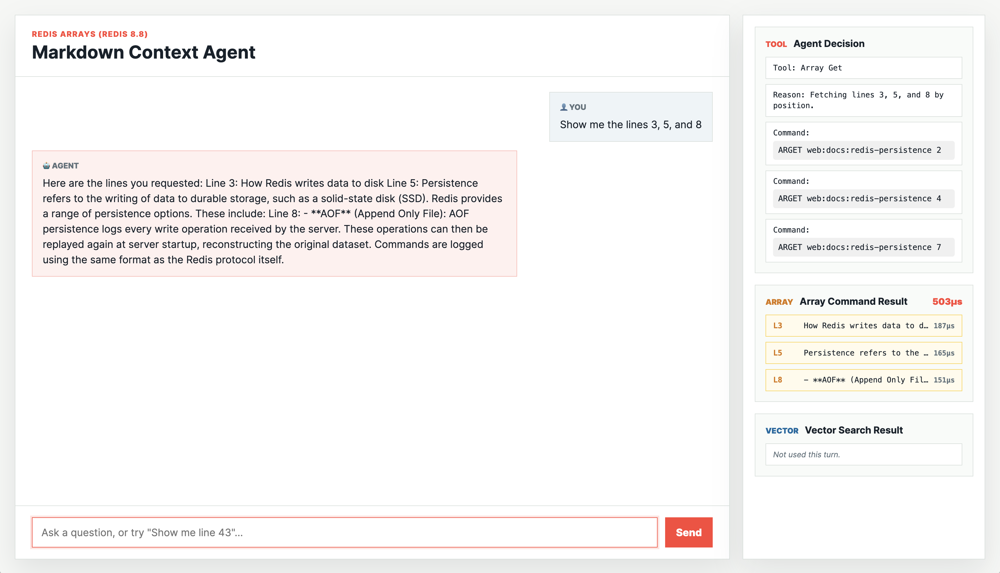

# Redis Array Context Demo

## Overview

This demo showcases the [Redis array](https://redis.io/docs/latest/develop/data-types/arrays) data type introduced in Redis 8.8 as a context retrieval layer for AI agents. Built with Python, FastAPI, OpenAI, and RedisVL, it demonstrates how arrays give agents a native way to store and retrieve text where line position and exactness matter, complementing rather than replacing semantic vector search.

The demo runs as a web app and a CLI. You load a Markdown document into a Redis array, then ask questions through a chat interface. The agent decides at runtime whether to use exact array operations (`ARGREP`, `ARGET`, `ARGETRANGE`, `ARLEN`) or vector similarity search (`FT.SEARCH`). The right panel shows full observability of which path was taken, the exact Redis command executed, and the latency of the Redis round trip.

## Table of Contents

- [Demo Objectives](#demo-objectives)
- [Setup](#setup)
- [Running the Demo](#running-the-demo)
  - [How the Agent Decides](#how-the-agent-decides)
  - [Pattern Matching](#pattern-matching)
  - [Web UI](#web-ui)
  - [CLI](#cli)
    - [Commands](#commands)
    - [Global --redis-url option](#global---redis-url-option)
  - [Suggested Demo Flow](#suggested-demo-flow)
  - [Debugging the Backend API](#debugging-the-backend-api)
    - [POST /api/chat](#post-apichat)
- [Architecture](#architecture)
  - [Redis Key Scheme](#redis-key-scheme)
  - [Ingestion Pipeline](#ingestion-pipeline)
  - [Project Structure](#project-structure)
  - [Running the Tests](#running-the-tests)
- [Known Issues](#known-issues)
- [Resources](#resources)
- [Maintainers](#maintainers)
- [License](#license)

## Demo Objectives

- Demonstrate Redis 8.8 Arrays as a first-class context store for AI agents when line position and exactness matter.
- Show the difference between exact retrieval (ARGREP, ARGET) and semantic retrieval (FT.SEARCH) for different query types.
- Give the agent full observability: which tool ran, which Redis command was issued, and the actual Redis round-trip latency.
- Illustrate how line position and exact matching complement vector search in document-grounded agents.
- Provide both a web app and a CLI so the same operations can be explored interactively and programmatically.

## Setup

### Dependencies

- [Docker](https://docs.docker.com/get-docker/) and Docker Compose for running the web app
- [Python 3.10+](https://www.python.org/downloads/) and [uv](https://docs.astral.sh/uv/) or pip for the CLI
- [Redis Insight](https://redis.io/insight/) for optional keyspace inspection
- [OpenAI API key](https://platform.openai.com/api-keys)

### Account Requirements

| Account | Description |
|:--------|:------------|
| [OpenAI](https://auth.openai.com/create-account) | LLM used to route tool calls and generate agent responses. |

### Configuration

1. Clone the repository:

   ```sh
   git clone <repository-url>
   cd redis-array-context-demo
   ```

2. Create your environment file:

   ```sh
   cp .env.example .env
   ```

3. Edit `.env` with your configuration:

| Variable | Required | Description |
|:---------|:--------:|:------------|
| `REDIS_URL` | Yes | Redis connection URL. Use `redis://redis-database:6379` for Docker, `redis://localhost:6379` for local. |
| `OPENAI_API_KEY` | Yes | API key used by the agent and embeddings. |
| `OPENAI_MODEL` | No | OpenAI model for agent responses. Defaults to `gpt-4.1-mini`. |
| `DEMO_MARKDOWN_FILE` | Yes | Path to the Markdown file loaded into Redis at startup. |
| `CLI_REDIS_URL` | No | Redis URL used by the CLI. Defaults to `redis://localhost:6379`. |

4. Build and start the app:

   ```sh
   docker compose up --build
   ```

## Running the Demo

Open `http://localhost:8080`.

The left pane is the chat interface. The right pane shows three panels updated after every turn: the agent's tool decision and the exact Redis command issued, the Array command result with line numbers and latency, and the vector search result with latency.

### How the Agent Decides

The agent receives the user's natural language question and applies a set of rules to select the right tool:

| User asks | Tool used | Redis command |
|:----------|:----------|:--------------|
| "How many lines does the document have?" | `count_lines` | `ARLEN` |
| "Show me line 43." | `fetch_lines` | `ARGET` |
| "Show me lines 40 to 50." | `fetch_lines` | `ARGETRANGE` |
| "Find all the headings." | `argrep_search` | `ARGREP … GLOB ## *` |
| "Show lines containing AOF." | `argrep_search` | `ARGREP … GLOB *AOF*` |
| "How does AOF persistence work?" | `vector_search` | `FT.SEARCH` |
| "Explain the difference between RDB and AOF." | `vector_search` | `FT.SEARCH` |

### Pattern Matching

The `argrep_search` tool automatically infers the match type from the pattern:

- **Plain text** — wrapped in glob wildcards for a contains search: `AOF` → `GLOB *AOF*`
- **Glob** — passed through as-is: `## *`, `save ?`
- **Regex** — passed through as-is: `^save `, `RDB|AOF`

### Web UI



The right panel refreshes after every turn with three sections:

- **Agent Decision** — which tool was selected, the reasoning, and the exact Redis command.
- **Array Command Result** — matched lines with 1-based line numbers and the Redis round-trip latency.
- **Vector Search Result** — top-k semantically relevant chunks and the Redis round-trip latency.

Latency is shown at sub-millisecond precision (`µs` for fast commands, `ms` otherwise). When a tool was not used in a turn, its panel shows a dimmed "Not used this turn." state.

### CLI

The CLI lets you load documents and run Array and vector operations directly from the terminal. It uses the same backend agent and tools as the web app. The CLI requires a running Redis instance. If you are not running the full web app, start only the database container:

```sh
docker compose up -d redis-database
```

Install dependencies using your virtualenv:

```sh
pip install -e .
```

Or activate the project virtualenv:

```sh
source .venv/bin/activate
```

By default the CLI connects to `redis://localhost:6379`. Override it with `--redis-url` or the `CLI_REDIS_URL` environment variable.

#### Commands

##### `load` — Ingest a Markdown file into Redis

```sh
python -m cli.main load docs/redis-persistence.md
# With --force to re-ingest an existing key:
python -m cli.main load docs/redis-persistence.md --force
```

##### `grep` — Run an ARGREP query

```sh
# Plain text (auto-wrapped as glob *AOF*)
python -m cli.main grep "AOF" --file docs/redis-persistence.md

# Glob — all headings
python -m cli.main grep "## *" --file docs/redis-persistence.md

# Regex
python -m cli.main grep "^save " --file docs/redis-persistence.md
```

##### `search` — Run a vector similarity search

```sh
python -m cli.main search "how does snapshotting work?" --file docs/redis-persistence.md
python -m cli.main search "difference between RDB and AOF" --file docs/redis-persistence.md --top-k 3
```

##### `chat` — Start an interactive agent session

```sh
python -m cli.main chat --file docs/redis-persistence.md
```

Each response shows the tool used, the Redis command issued, and the latency:

```
  Tool: Array Grep  ·  array 312µs
  Pattern search for: AOF
  $ ARGREP cli:docs:redis-persistence 0 … GLOB *AOF* WITHVALUES

Agent: There are 8 lines mentioning AOF...
```

#### Global `--redis-url` option

The `--redis-url` flag must be placed before the subcommand:

```sh
python -m cli.main --redis-url redis://myhost:6379 chat --file docs/redis-persistence.md
```

### Suggested Demo Flow

1. Start the demo with `docker compose up --build`.
2. Ask "How many lines does the document have?" — shows `ARLEN` and sub-millisecond latency.
3. Ask "Show me line 5." — shows `ARGET` with the exact line content.
4. Ask "Show me lines 3 to 9." — shows `ARGETRANGE` with the full range.
5. Ask "Find all the headings." — shows `ARGREP` with glob pattern and matched lines.
6. Ask "How does AOF persistence work?" — shows `FT.SEARCH` and top-k semantic results.
7. Ask "Find lines containing AOF, then explain how it works." — shows both tools in one turn.
8. Inspect the keyspace in Redis Insight to see the Array key and vector index side by side.

### Debugging the Backend API

| Method | Path | Purpose |
|:-------|:-----|:--------|
| `GET` | `/api/health` | Liveness check. |
| `GET` | `/api/ready` | Readiness check — verifies Redis connection, Array key, and vector index. |
| `POST` | `/api/chat` | Run one agent turn. |

#### `POST /api/chat`

**Request:**
```json
{ "message": "Show me the third line." }
```

**Response:**
```json
{
    "user_message": "Show me the third line.",
    "assistant_message": "The third line is: \"How Redis writes data to disk\"",
    "tool_used": "fetch",
    "tool_reasoning": "Fetching line 3 by position.",
    "tool_commands": [
        "ARGET web:docs:redis-persistence 2"
    ],
    "grep_results": [
        {
            "line": 3,
            "content": "How Redis writes data to disk",
            "latency_ms": 0.396
        }
    ],
    "total_latency_ms": 0.396,
    "vector_results": [],
    "vector_latency_ms": null
}
```

## Architecture

One agent turn runs as follows:

1. The user's message is passed to a tool-calling agent with four tools bound to it: `count_lines`, `fetch_lines`, `argrep_search`, and `vector_search`.
2. The LLM selects a tool (or no tool) and returns a tool call.
3. The selected tool issues a Redis command — ARLEN, ARGET, ARGETRANGE, ARGREP, or FT.SEARCH — and times only the Redis round-trip using `perf_counter_ns()`. A pre-warm `execute_command` call runs before the timer to ensure the connection pool returns a warm socket.
4. The tool result is fed back to the LLM as a `ToolMessage`. The LLM generates the final response.
5. The backend parses the tool observations to extract results and latencies, and returns a structured `TurnResult` to the API layer.

### Redis Key Scheme

Both the web app and CLI share one Redis instance but use distinct key prefixes to keep the keyspace readable:

```
web:docs:{slug}    # Array key — one element per document line (web app)
web:idx:{slug}     # Vector index — non-blank, non-fence lines (web app)

cli:docs:{slug}    # Array key — loaded via CLI load command
cli:idx:{slug}     # Vector index — loaded via CLI load command
```

`{slug}` is the Markdown filename, lowercased and slugified — e.g., `redis-persistence.md` → `redis-persistence`.

### Ingestion Pipeline

When a Markdown file is loaded (web startup or `cli load`):

1. Read the file and split into lines, preserving blank lines to maintain accurate 1-based line numbering.
2. Write to Redis as an Array via `ARINSERT`, one element per line, in batches of 500.
3. Filter out blank lines and markdown structural noise (code fences, horizontal rules) for the vector index.
4. Generate embeddings for content-bearing lines using `text-embedding-3-small`.
5. Create a RedisVL flat vector index and load the embeddings.

Ingestion is idempotent — if the Array key already exists, startup skips re-ingestion.

### Project Structure

```
redis-array-context-demo/
├── backend/
│   ├── app.py          # FastAPI routes and lifespan startup
│   └── agent.py        # Tools, agent executor, ingestion, parsers
├── cli/
│   └── main.py         # Typer CLI — load, grep, search, chat commands
├── frontend/
│   ├── index.html
│   ├── styles.css
│   └── app.js
├── docs/               # Bundled sample Markdown document
├── tests/
│   ├── conftest.py
│   ├── test_agent.py   # Unit tests — parsers, tools, key helpers
│   ├── test_api.py     # FastAPI endpoint tests
│   └── test_cli.py     # CLI command tests via Typer CliRunner
├── data/               # Redis persistence volume (gitignored)
├── images/
├── .env.example
├── docker-compose.yml
├── Dockerfile.backend
├── Dockerfile.frontend
└── pyproject.toml
```

### Running the Tests

The unit tests require no external services — no Redis connection, no OpenAI key. All Redis and LLM calls are mocked.

```sh
python -m pytest -m "not integration" -v
```

The unit tests are organized into three files:

- `test_agent.py` — unit tests for key helpers, pattern detection, observation parsers, and all four tool functions with a mocked Redis client.
- `test_api.py` — FastAPI endpoint tests via `TestClient` with Redis and the agent mocked out.
- `test_cli.py` — CLI command tests via Typer's `CliRunner`, covering all four commands, error paths, and the global `--redis-url` option.

### Integration Tests

The integration tests spin up a real `redis:8.8.0` container via [Testcontainers](https://testcontainers.com/) and exercise the Array commands (ARGET, ARGETRANGE, ARGREP, ARLEN) against actual Redis behaviour. Docker must be running.

```sh
pip install -e ".[test]"
pytest -m integration -v
```

A single container is shared across all 29 integration tests (session scope). Each test flushes the database on teardown so state never leaks between tests. To run the full suite — unit and integration — together:

```sh
pytest -v
```

## Known Issues

- The array commands (ARGREP, ARGET, ARGETRANGE, ARLEN, ARINSERT) require Redis 8.8 or later. The Docker Compose file pins the image to `redis:8.8`.
- Rebuilding the frontend container is required whenever `frontend/` files change: `docker compose up --build frontend`. Changes to `frontend/` are baked into the Nginx image at build time.
- The CLI connects to `redis://localhost:6379` by default, which goes through Docker's port mapping and adds a small amount of network overhead compared to the web backend's container-to-container connection.
- Vector search quality depends on the embedding model and the content of the document. Code fences and other structural markdown noise are excluded from the index at ingestion time.

## Resources

- [Redis 8.8 release notes](https://github.com/redis/redis/releases/tag/8.8.0)
- [RedisVL documentation](https://docs.redisvl.com/en/latest/)
- [OpenAI function-calling documentation](https://platform.openai.com/docs/guides/function-calling)
- [OpenAI API documentation](https://platform.openai.com/docs)

## Maintainers

**Maintainers:**
- Ricardo Ferreira — [@riferrei](https://github.com/riferrei)

## License

This project is licensed under the MIT License.
